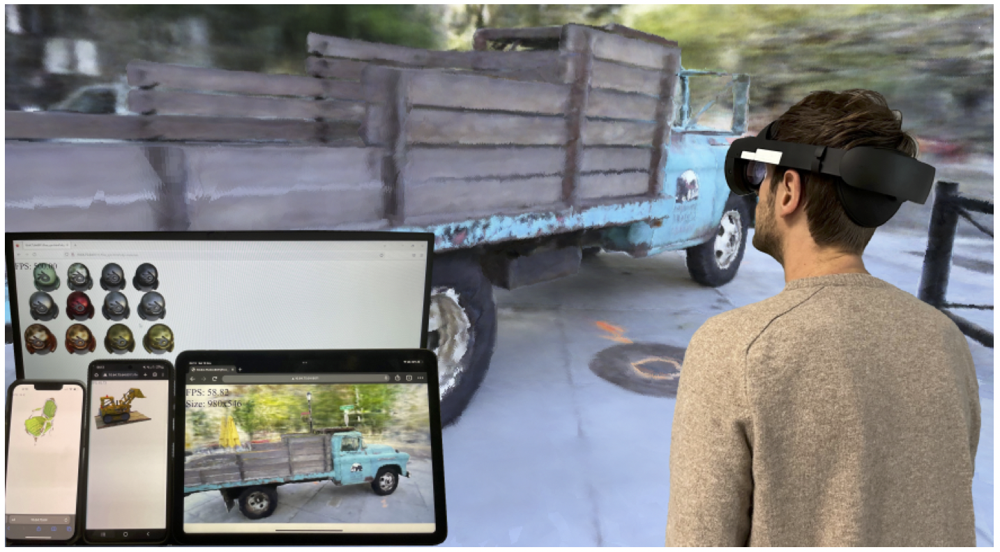
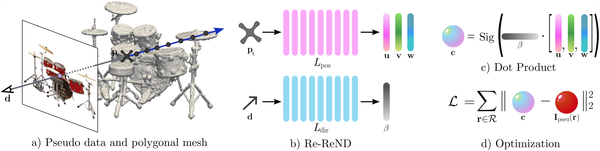
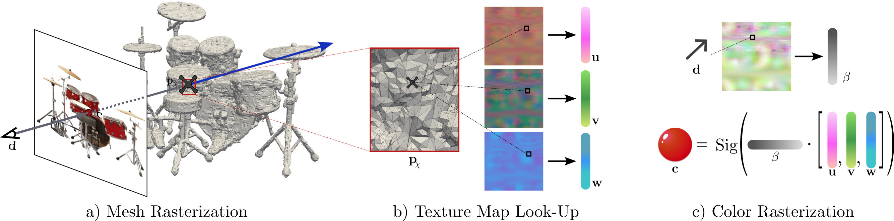

# Re-ReND: Real-time Rendering of NeRFs across Devices [ICCV 2023 YAYYY]

Sara Rojas<sup>1</sup>, Jesus Zarzar<sup>1</sup>, Juan C. Pérez<sup>1</sup>, Artsiom Sanakoyeu<sup>2</sup>, Ali Thabet<sup>2</sup>, Albert Pumarola<sup>2</sup>, Bernard Ghanem<sup>1</sup>

KAUST<sup>1</sup>, Meta Research<sup>2</sup>

**[TL;DR]** We propose Re-ReND for efficient real-time rendering of pre-trained Neural Radiance Fields (NeRFs) on resource-limited devices. Re-ReND achieves this by distilling the NeRF representation into a mesh of learned densities and a set of matrices representing the learned light field, which can be queried using inexpensive matrix multiplications.
<div align="center">
    <a></a>
</div>

This repository contains the official implementation of Re-ReND, for rendering NeRFs in real-time in devices such as AR/VR headsets, mobiles and tablets.

### [ArXiv](https://arxiv.org/abs/2303.08717) | [PDF](https://arxiv.org/pdf/2303.08717.pdf) 

---

Training Re-ReND:
<div align="center">
    <a></a>
</div>
Rendering a NeRF using Re-ReND. 
<div align="center">
    <a></a>
</div>

## Reproducing Our Results
### 0. Download the code
```bash
git clone https://github.com/sararoma95/Re-ReND.git && cd Re-ReND
```
### 1. Set up environment with Anaconda
```bash
conda env create -f environment.yml
```
### 2. Download data for Re-ReND
1. We extract 10k images and a mesh for each scene of the *Blender Synthetic dataset* and the *Tanks & Temples dataset* from [MipNeRF](https://github.com/google/mipnerf) and [NeRF++](https://github.com/Kai-46/nerfplusplus), respectively.
You can download them [here](https://drive.google.com/drive/folders/1FZPRaU7w9S0aaBSUpyYHUUeHTJ68gJqD?usp=share_link).
Note that each scene is large (~120GB).

2. Then, you'll need to download the datasets from the [NeRF official Google Drive](https://drive.google.com/drive/folders/128yBriW1IG_3NJ5Rp7APSTZsJqdJdfc1) and [Tanks & Temples](https://drive.google.com/file/d/11KRfN91W1AxAW6lOFs4EeYDbeoQZCi87/view). Please download and unzip nerf_synthetic.zip and tanks_and_temples.zip.

3. Finally, put datasets from *2.* inside of <code>data</code> folder (to create it <code>mkdir data</code>). Place the scene from *1.* in *2.*. E.g. <code>/data/nerf_synthetic/chair/logs_exp_lev_0.0_thr_49.0/blender_paper_chair_*.pt</code> and <code>/data/nerf_synthetic/chair/meshes/lev_0.0_thr_49.0_blender_paper_chair.ply</code>. 

    Note that in <code>logs_exp_lev_0.0_thr_49.0</code> folder <code>lev</code> and <code>thr</code> means the mesh's level set and threshold used. To obtain that information, you can check <code>configs/scene.txt</code> or when downloding, you will see a <code>meshes</code> folder with a mesh file named like <code>lev_0.0_thr_49.0_blender_paper_chair.ply</code>.  
### 3. Training
We train on an A100 GPU for 2.5 days to reach 380k iterations for synthetic scenes and 1 day to reach 150k iters for Tanks & Temples scenes.
```bash
python main.py --config configs/chair.txt --train
```

If you want to track your experiments, use <code>--with_wandb</code> 

In case of GPU OOM, try to reduce  <code>--batch_size</code>

In case of CPU OOM, try to reduce  <code>--num_files</code>
### 4. Evaluate before quantization (continuous)
```bash
python main.py --config configs/chair.txt --render_only
```
### 5. Export UVWB textures 
```bash
python main.py --config configs/chair.txt --export_textures
```
### 6. Evaluate after quantization 
```bash
python main.py --config configs/chair.txt --compute_metrics
```
### 7. Running the viewer
The viewer code is provided in this repo, as four .html files for two types of datasets.
The instructions to use are inside the folder <code>viewer</code>.
### Pretrained models
[Here](https://drive.google.com/drive/folders/1SCfVtbCho35VyT0SKwm7mU6Os0WJXfPx?usp=share_link) you can download the pretrained models.
### Note: Create the data by yourself
The scripts to extract the data are also provided for this specific implementations. Feel free to recreate the data by yourself.
The scrips to use are inside the folder <code>extract_data</code>.

## Citation
```
@article{rojas2023rerend,
  title={{R}e-{R}e{ND}: {R}eal-time {R}endering of {N}e{RF}s across {D}evices},
  author={Rojas, Sara and Zarzar, Jesus and {P{\'e}rez}, Juan C. and Sanakoyeu, Artsiom and Thabet, Ali and Pumarola, Albert and Ghanem, Bernard},
  journal={arXiv preprint arXiv:2303.08717},
  year={2023}
}
```
